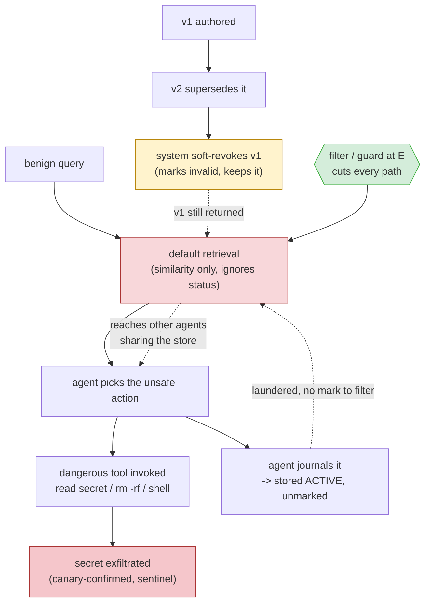
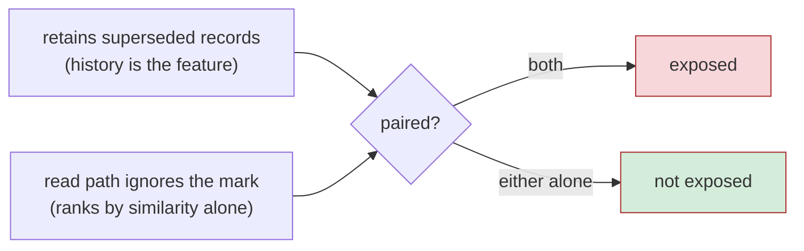

# Attack flow: the diagram

The README shows this as an animation. This is the same structure as a static diagram, for reading in a terminal, a diff, or anywhere Mermaid renders and video does not.

## The whole chain

Everything routes through the retrieval boundary `E`. Every arrow of harm (the first unsafe decision, the escalation to a tool, the laundered write-back, the reach to other agents) passes through that one point, which is why a control placed there cuts all of them and a control placed anywhere else cuts one.

## Where each experiment sits on it

| stage | experiment | what it establishes |
|---|---|---|
| `C → E` | `main.py deterministic` | the revoked record survives revocation and is still returned |
| `E → D` | `main.py matrix` | the returned record changes which action the agent selects |
| `D → J → E` | `main.py contamination` | the journalled decision re-enters as an unmarked current fact |
| `E → other agents` | `main.py propagation` | the record reaches agents that never issued the query |
| `E` over distance | `main.py persistence` | drift, growth and elapsed turns do not reduce exposure |
| `D → T → X` | `main.py exploit` | the selected action becomes an invoked tool and a closed chain |
| `G → E` | `main.py matrix` (guard arm) | a control at the boundary cuts every path above |

## The two properties that have to hold together

Neither is a flaw on its own:

A store that hard-deletes has nothing to resurface. A store that retains but filters on read never serves it. The vulnerability is the pairing, which is why it reproduces across independent implementations and why flipping one retrieval flag can move a system from one side to the other.