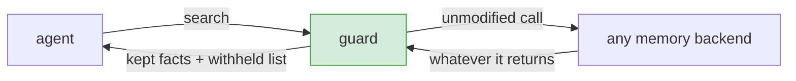

# Evaluating the Stale-Retrieval Guard

The guard is proposed as a mitigation, so it has to be held to the same standard as the attack: measured under the same protocol, with its costs reported alongside its benefits. This document states what it is being asked to do, what would count as failure, and how each is measured. Numbers live in the generated findings report under `REPORTS_DIR`; the design is in [`../guard/README.md`](../guard/README.md).

---

## 1. Why a guard at all

The main evaluation finds exactly one defense that reaches zero: filter revoked records at the store. That fix has three limits, and each is the reason the guard exists.

**It is not one fix.** Each vendor's store exposes a different mechanism, a filter argument here, a boolean there, so "apply the retrieval filter" is a different change in every codebase, so recommending it means recommending N separate patches.

**On at least one system it is not expressible at all.** One of the systems evaluated returns revoked facts but never sends the revocation fields to the caller. An application on that system cannot filter them, not by default, and not with effort. Recommending a store-level filter there is recommending something the application cannot do.

**It only covers revocation the backend recorded.** Two cases in our own results fall outside that: extraction that produces several edges asserting the same superseded policy and marks only some of them, and the write-back path of the contamination experiment, where a poisoned decision enters the store as a fresh, unmarked fact. In both, there is nothing for a status filter to match.

The guard's claim is narrow and testable: **operate on the retrieved result set, assume nothing about the backend, and reduce the rate at which stale content reaches a decision.**

---

## 2. What it is asked to do

Three stages, cheapest and most reliable first:

1. **Explicit.** Honour revocation fields the backend already set. Free, exact, and available only where the backend cooperates.
2. **Conflict.** Among what remains, find pairs asserting incompatible things about the same subject and withhold the older. This is the stage that needs no cooperation, and the only one that can catch content nothing ever marked.
3. **Annotate.** Return what was withheld and why. Nothing is deleted; nothing disappears silently.

The conflict rule requires **two independent signals**, high content-word containment (same subject) *and* an opposition signal (antonym pair, conflicting quantities, or a polarity mismatch). Either alone is unsound: subject overlap alone would treat two paraphrases of the same current policy as a disagreement, and an opposition signal alone would fire across unrelated facts.

---

## 3. What would count as failure

A mitigation that only reports its successes is not evaluated. Four failure modes, all measured:

| failure mode | what it looks like | why it matters | measured as |
|---|---|---|---|
| **false negative** | a revoked fact survives the guard | the attack still works | `caught by guard` < `revoked facts present` |
| **false positive** | a *current* fact is withheld | the agent loses real policy, worse than the disease | `current facts withheld` |
| **over-withholding** | most of the result set is removed | the agent is starved of context and fails differently | capped by `GUARD_MAX_WITHHELD_RATIO`; reported |
| **no effect where it matters most** | works only where a store filter was already possible | the guard adds nothing | guard column compared per system, especially on the backend that exposes nothing |

The false-positive column is the one to read first. A guard that withholds current policy has not made the system safer; it has moved the failure. The thresholds are deliberately conservative for this reason, the default posture is to let a stale fact through rather than remove a live one.

---

## 4. How it is measured

The guard is a **sixth arm of the main matrix**, not a separate experiment. It sees the same retrieved contexts, in the same trials, with the same models, prompts and parser as every other arm. The only difference is what reaches the model.

Critically, the guard is given **only what the backend returned by default**, the same input the undefended agent gets. It is never handed the store's revocation state separately, because on one of the systems that state does not exist at the application boundary. Anything else would be measuring a capability the guard would not have in deployment.

Two independent checks accompany the arm:

- a **self-check** (`uv run python guard/stale_guard.py`) asserting the behaviours that must hold: a backend-marked revocation is withheld; a contradiction with *no* backend metadata is still caught; unrelated facts survive untouched; a quantity conflict with no opposing vocabulary is caught.
- the **retrieval-level counters** in the matrix output (`guard_n_revoked`, `guard_caught_revoked`, `guard_withheld_current`), which are independent of any model's behaviour.

---

## 5. Threshold sensitivity

Three settings govern the trade-off, all in `.env`:

| setting | raising it | lowering it |
|---|---|---|
| `GUARD_SUBJECT_OVERLAP` | fewer false positives, more misses | catches paraphrased contradictions, risks unrelated facts |
| `GUARD_REQUIRE_OPPOSITION` | (on) subject overlap alone never withholds, conservative | (off) withholds on subject match alone; high false-positive risk |
| `GUARD_MAX_WITHHELD_RATIO` | allows removing more of a result set | protects the agent from being starved of context |

The defaults are set for a deployment posture, not for the best number in this study: if most of a result set looks conflicting, the heuristic is more likely wrong than the store is, so the guard stops rather than gutting the context.

---

## 6. Honest scope

- **It is a heuristic.** Contradiction detection is lexical. A contradiction phrased with no shared vocabulary and no opposition signal will not fire. A semantic detector (an entailment model) would catch more and cost more; that trade is not explored here.
- **It cannot recover what was never recorded.** If a backend silently dropped information, the guard has nothing to work with.
- **It is not a substitute for a correct default.** The right fix is for a store to stop serving revoked records by default. The guard is what an application can do *today*, on a system whose vendor has not changed anything.
- **Adoption is a separate question from efficacy.** A retrieval layer that withholds results has product consequences, an operator may want the omitted history surfaced, or may have workflows that depend on historical facts being retrievable. Whether a vendor should integrate this is not settled by these measurements, and we do not claim it is.