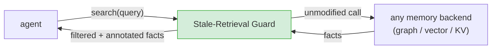

# Stale-Retrieval Guard: a backend-agnostic mitigation

The evaluation shows one defense that works: filter revoked records at the store. That
fix has two problems in practice.

**It has to be built by each vendor, differently.** Graphiti needs a `SearchFilters`
argument; mem0 needs a boolean flipped; Zep would need an API change before an
application could do anything at all, because it does not return the revocation fields
to callers. There is no single patch.

**It only covers revocation the backend recorded.** If the contradiction was never
detected: a duplicate edge that extraction failed to link, a decision an agent wrote
back into memory (see the contamination experiment). Nothing is marked, so nothing is
filtered.

The guard takes the other position available: sit **between the agent and whatever
memory it uses**, and work on the retrieved set itself.

## What it can rely on

Not much, deliberately. The guard assumes only that the backend returns a list of
facts, each with text and optionally some metadata. It uses, in order of preference:

| signal | when available | what it does |
|---|---|---|
| explicit revocation fields (`expired_at`, `invalid_at`, `valid_to`, …) | backend exposes them | drop the record |
| timestamps (`created_at`, `updated_at`, `valid_at`) | most backends | order candidates for the conflict rule below |
| **pairwise contradiction between returned facts** | always | when two facts assert incompatible things about the same subject, keep the newer and withhold the older |

The third signal is the one that matters. It needs no backend cooperation, so it works
on Zep, where the retrieval-layer fix is not expressible, and it catches stale content
that was never marked revoked at all, including laundered decision write-backs.

## What it deliberately does not do

- It does not delete anything. It filters a *response*; history stays intact, which is
  the whole point of keeping it.
- It does not silently discard. Withheld facts are returned in a separate field so an
  application can surface "there is an older conflicting policy" rather than pretend it
  never existed.
- It does not need the agent's model, prompt, or tool definitions to change. The guard
  is a drop-in wrapper around a search call.

## Two integration shapes

- **Library** (`guard/stale_guard.py`): wrap any search function.
- **MCP server** (`guard/mcp_server.py`): expose `search_memory_guarded` so an agent
  gets the protected tool instead of the raw one, with no application code change.

## Honest scope

This is a mitigation, not a fix. It reduces the chance that stale content reaches a
decision; it cannot restore information the backend never recorded, and its
contradiction detection is a heuristic with both false positives (withholding a fact
that was merely similar) and false negatives (a contradiction phrased so differently
that no signal fires). Both rates are measured rather than assumed; see the guard
evaluation arm in the matrix and `docs/GUARD_EVALUATION.md`.

Whether a vendor should adopt it is a separate question from whether it works: a
retrieval layer that withholds results has its own product consequences, and a vendor
may reasonably prefer to fix the default in their own store instead. The guard's value
is that it is available to the *application* today, on backends whose vendors have not
changed anything.
